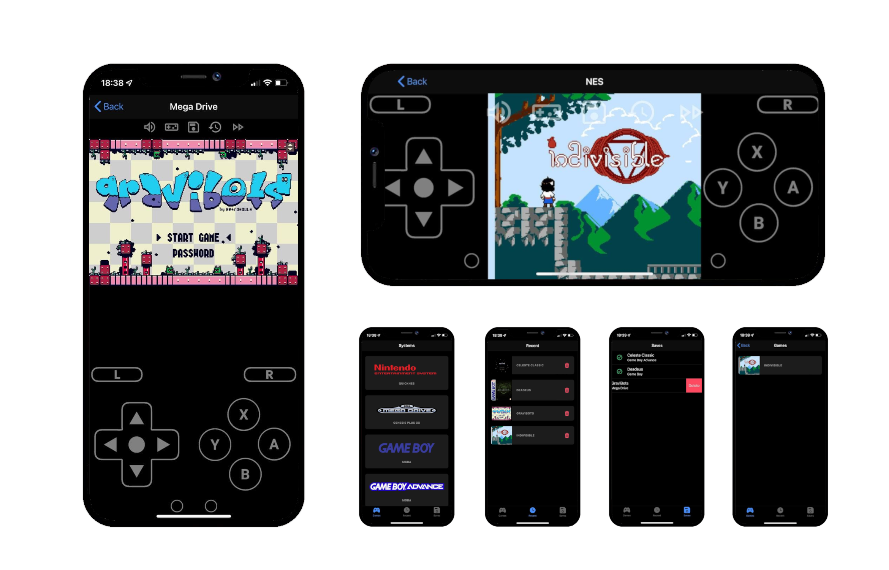

# Junie

Junie is a [Libretro](https://www.libretro.com/index.php/home-2/) frontend that aims to run entirely in your browser, desktop or mobile!
* No installation on the end-devices.
* Near-native performances thanks to WebAssembly.
* Wide range of supported/compatible cores (... soon).
* Progressive Web Application fully accessible offline.

Junie currently runs on most recent browsers, but your experience will probably be better on Chrome and Safari.

[Demo](https://junie.herokuapp.com/): here you can play
[Indivisible](https://kasumi.itch.io/indivisible),
[Celeste Classic](https://github.com/JeffRuLz/Celeste-Classic-GBA),
[Daedeus](https://izma.itch.io/deadeus) and
[GraviBots](https://retrosouls.itch.io/gravibots16bit).

***Disclaimer**: development is still in progress. I'll try my best not to break anything between releases (especially regarding local save files), but it's probably a good idea for you to backup your saves before each update.*



# Supported features

- [x] All the systems described in the [Folder structure](#folder-structure).
- [x] Save files and cheats (stored inside your browser's storage).
- [x] Core-specific configurations override.
- [x] Multi-touch controller, with D-pad used as a joystick.
- [x] Re-mappable keyboard to joypad bindings.
- [x] Touch inputs, enabled by pressing the top button.
- [x] Savestate creation and restore.
- [x] Fast-forward up to 4 times the original speed.
- [x] Nice platform-specific user interface.
- [x] Fully working offline from your homescreen.

# Folder structure

Games must be organized as follows, inside a `games` folder next to the application binaries:

```
games
├── Game Boy
├── Game Boy Advance
├── Game Boy Color
├── Master System
├── Mega Drive
├── NES
├── Nintendo DS
└── SNES
```

# Side notes

## Cores compatibility

Well, when I wrote "wide range of cores", it might be a little exagerated...

Junie is using the [wasi-sdk](https://github.com/WebAssembly/wasi-sdk) to build the cores, and it currently lacks features that cores sometimes use extensively.
Right now, the most problematic ones are threading and JIT backend. Also, no OpenGL support at this time (this one is actually doable but probably requires a lot of work).

That said, even after disabling all the above features when building the cores, performance is still acceptable for most cores. You will however have some trouble with 3D games on Nintendo DS (2D games run quite fine on recent hardware, as far as I've tested). Low-end mobile phones might also struggle with the SNES.

# Build & Run

## Prerequisites

Junie is composed of 3 main components:
* The **UI**: developed in JSX using React and Ionic, located in the [ui](ui) folder
* The **Emulator**: developed in C using libmatoya, located in the [app](app) folder

To initialize the submodules if you haven't already:

```bash
git submodule sync
git submodule update --init
```

## Build

First, install the following dependencies: **yarn**, **python**, **make**, **zip** and **xxd**. Then download the [wasi-sdk](https://github.com/WebAssembly/wasi-sdk) and extract it in your home directory.

```bash
make       # Build cores, libraries and the application
make pack  # Same as `make`, but also outputs binary in a zip file
make watch # Same as `make`, but also rebuild on file changes
```

## Docker

If you prefer to use Docker, no need for any local dependencies:

```bash
docker run \
    -d --rm \
    --name junie \
    -p 8000:8000 \
    -v /path/to/games:/junie/games \
    namaneo/junie
```

# Next steps

- [ ] Synchronize save files for cross-browser play.
- [ ] Build Junie for `libmatoya`'s supported platforms as well.
- [ ] Multiplayer support, both locally and through WebRTC.

# Credits

## Libraries

- The main framework used here is [libmatoya](https://github.com/matoya/libmatoya).
- The [zlib](https://github.com/madler/zlib) library is required for some cores.
- Thumbnails are retrieved from [libretro-thumbnails](https://thumbnails.libretro.com/)
- Modules and headers from [libretro-common](https://github.com/libretro/libretro-common).

## Cores

- [mGBA](https://github.com/libretro/mgba) for Game Boy, Game Boy Color and Game Boy Advance emulation.
- [Snes9x](https://github.com/libretro/snes9x) for SNES emulation.
- [melonDS](https://github.com/libretro/melonDS) for Nintendo DS emulation.
- [Genesis Plus GX](https://github.com/libretro/Genesis-Plus-GX) for Mega Drive and Master System emulation.
- [QuickNES](https://github.com/libretro/QuickNES_Core) for NES emulation.

## Assets

- Original controller assets come from the [Delta emulator](https://github.com/rileytestut/Delta).
- Menu graphics come from the [Google Material Icons](https://fonts.google.com/icons).
- Loading screen comes from [Pixel Art Maker](http://pixelartmaker.com/art/8f6c49d5035cd32) (not sure exactly who to credit).
- Game cover [placeholder](https://pixabay.com/vectors/game-console-icon-video-play-2389215/) reworked from [Memed_Nurrohmad](https://pixabay.com/users/memed_nurrohmad-3307648/?tab=about)'s work.

# License

Junie is licensed under the [GNU General Public License v3.0](https://github.com/Namaneo/Junie/blob/main/LICENSE.md). When applicable, dependencies listed in the [Credits](#credits) section retain their original licenses.
